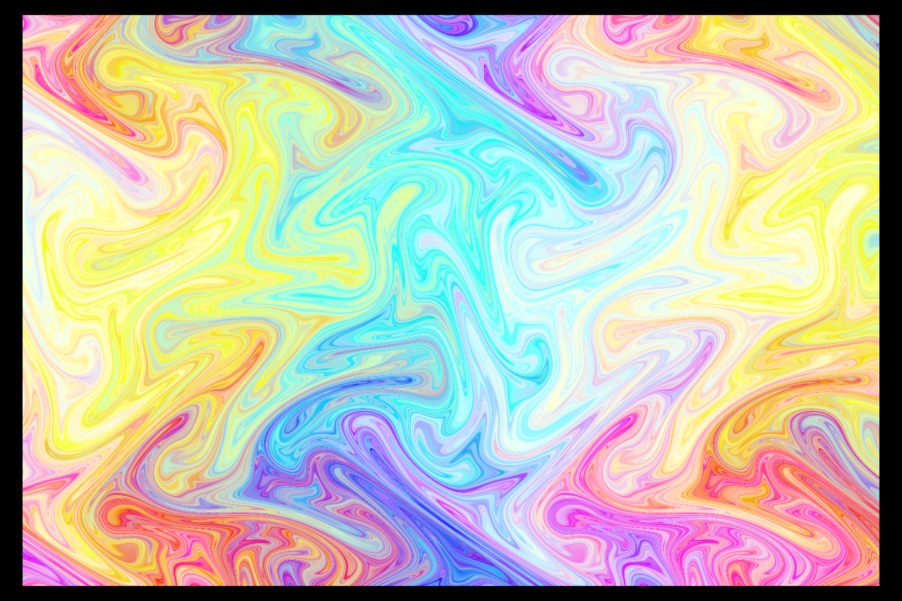
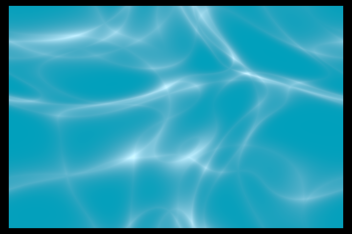

# shadplay


<center>artwork by Maz with SD</center>

[](https://github.com/bevyengine/bevy/blob/main/docs/plugins_guidelines.md#main-branch-tracking)

<!-- Badges to insert at some stage... 
[](https://docs.rs/shadplay) SOME DAY...
[](https://github.com/shadplay/bevy#license)
[](https://crates.io/crates/bevy)
[](https://crates.io/crates/bevy)
[](https://docs.rs/bevy/latest/bevy/)
[](https://github.com/bevyengine/bevy/actions)
-->

## Our [bevy-shader-cheatsheet](bevy-shaders-cheatsheet.md#Contents)

Shadplay is an app designed to help you learn `wgsl` with minimal friction, specifically for those wanting to learn `wgsl` to write shaders for [Bevy](https://bevyengine.org/).

A secondary goal is to flesh out a relatively comprehensive 'port' of existing cool shader work from places like shadertoy etc -- because there's a few 'gotchas' around the differences in `glsl` and `wgsl` syntax, their respective builtins.

A tertiary goal is to surface the builtins/existing library code that bevy's codebase provides.

You will notice a large swath of the `wgsl` code from the Bevy codebase here, _we_ want it to be available to you and searchable (within your IDE) as, the `lsp` story for `wgsl` is not a great one... _yet_!.

______________________________________________________________________

### Why?

> I have found, and continue to find the shader-universe impenetrable, however: I'd rather attempt to write up and document the content I _wish_ I'd been able to find in my first google search, than complain.

______________________________________________________________________

## Features

- A large collection of example shaders illustrating creative and educational uses. `assets/shaders/yourshadergoeshere.wgsl`.
- Live preview of shader code on bevy mesh geometry.
- Textures, see `assets/shaders/howto-texture.wgsl`.
- Drag and drop `.png` or `.jpg` files onto the window to use as said textures.
- Mouse coords over a `uniform`, see `assets/shaders/howto-mouse.wgsl`.
- Colour picker with system copy so that you get an immediate `vecf3(r, g, b)` immediately available for quick pasta action.
- Drag and drop (valid `wgsl`) shaders onto the app window to see them working.
- Tips and Tools to format your `wgsl` work, so it looks more rusty (which will help you quickly get up to speed with the existing `wgsl` in the Bevy codebase).
- Scripts to pull _all_ the functions from the Bevy codebase's shader code so you can easily lookup what's available for import. (See `scripts/README.md`)
- Scripts to search the Bevy source code (opening your browser) for specific keywords. (See `scripts/README.md`)
- Continious image capture to create .gifs! (Currently only supporting a maximum framerate of 20FPS for capture.)
- Automatic recompilation and update of shaders upon saving changes in your editor.
- Quick iteration and experimentation with `wgsl` shader code.
- Transparent background, with always-on-top (so you can have it on top of your editor, most OSes should be supported).
- Screenshot the shader you're working on with <kbd>SPACEBAR</kbd>, this will also version the shader (at `assets/shaders/myshader.wgsl`) for you i.e:

```shell
 screenshots
└──|  01-10-23
    └──| 09-23-29
        ├──|  screenshot.png // Your screenshot
        └──|  screenshot.wgsl// The shader at `assets/shaders/myshader.wgsl`
```

### Keybindings:

The app has some simple hotkeys:

| Hotkey              | Action                                                                            |
| ------------------- | --------------------------------------------------------------------------------- |
| <kbd>q</kbd>        | Quit                                                                              |
| <kbd>s</kbd>        | Change Shape in 3D                                                                |
| <kbd>tab</kbd>      | Toggles the colour picker (should be supported on most systems...)                |
| <kbd>t</kbd>        | Switch to 2D/ShaderToy Mode                                                       |
| <kbd>h</kbd>        | Switch to 3D                                                                      |
| <kbd>l</kbd>        | Window-Level                                                                      |
| <kbd>d</kbd>        | Toggle Decorations (not all OSes)                                                 |
| <kbd>t</kbd>        | Toggle Transparency (returning to fully transparent is not supported)             |
| <kbd>r</kbd>        | Toggle Rotating shape (3d only)                                                   |
| <kbd>spacebar</kbd> | Takes a screenshot && versions the current `.wgsl`                                |
| <kbd>return</kbd>   | Takes screenshots continiously, hit `return` again to stop capture                |
| <kbd>0</kbd>        | Select the `texture` at index 0                                                   |
| <kbd>1</kbd>        | Select the `texture` at index 1 (assuming you drag-n-dropped a texture onto Shadplay) |
| <kbd>2</kbd>        | Select the `texture` at index 2                                                   |
| <kbd>3</kbd>        | Select the `texture` at index 3                                                   |
| <kbd>4</kbd>        | Select the `texture` at index 4                                                   |
| <kbd>5</kbd>        | Select the `texture` at index 5                                                   |
| <kbd>6</kbd>        | Select the `texture` at index 6                                                   |
| <kbd>7</kbd>        | Select the `texture` at index 7                                                   |
| <kbd>8</kbd>        | Select the `texture` at index 8                                                   |
| <kbd>9</kbd>        | Select the `texture` at index 9                                                   |
| <kbd>?</kbd>        | Opens the Help UI                                                                 |

______________________________________________________________________

### To run shadplay, you'll need the following:

- Rust (`nightly`) - Make sure you have Rust installed on your system. You can find installation instructions at [https://www.rust-lang.org/tools/install](https://www.rust-lang.org/tools/install).
  _We assume you can follow their instructions to clear that hurdle_

_Question: Why Nightly?_ so we can take advantage of the fast build config (See bevy repo's `.cargo/config.toml`)

then:

### Installation

```shell
 $ git clone https://github.com/alphastrata/shadplay.git
 $ cd shadplay
 $ cargo run --release
```

- Then edit the `myshader.wgsl`, or `myshader_2d.wgsl`(if in 2d/shadertoy-mode) file in real time. (<kbd>h</kbd>, and <kbd>t</kbd> to move between 2d/3d).

______________________________________________________________________

## Contributing:

See the [guide](./CONTRIBUTING.md)

______________________________________________________________________

## TODO:

- \[\] More shader examples (the entirety of shadertoy ported!)
- \[\] drag n drop obj/stl/gltf opening?
- \[\] left/right arrows to swap between shaders from the assets' dir

______________________________________________________________________

## Resources:

- [Fantastic implementations of some sdf composed shapes](https://gist.github.com/munrocket/f247155fc22ecb8edf974d905c677de1)
- [GM Shaders](https://mini.gmshaders.com)
- [glsl sandbox](https://glslsandbox.com/)
- [Shadertoy](https://www.shadertoy.com/)
- [pcf swap by DGriffin91](https://github.com/DGriffin91/bevy_mod_standard_material/tree/pcf)
- [GLSL2WGSL converter](https://eliotbo.github.io/glsl2wgsl/), it's a mixed bag..
- [bevy_shadertoy_wgsl](https://github.com/eliotbo/bevy_shadertoy_wgsl)

______________________________________________________________________

# Gallery:

- Any shaders in the `assets/shaders` _not_ by the repo's owner contain links to the original work, and obviously their original glsl code is, still theirs.
- Some of those can be seen below

<table>
  <tr>
    <td></td>
    <td></td>
  </tr>
  <tr>
    <td></td>
    <td></td>
  </tr>
  <tr>
    <td></td>
    <td></td>
  </tr>
  <tr>
    <td></td>
    <td></td>
  </tr>
  <tr>
    <td></td>
    <td></td>
  </tr>
  <tr>
    <td></td>
    <td></td>
  </tr>
  <tr>
    <td></td>
    <td></td>
  </tr>
</table>

______________________________________________________________________

# FAQ:

Q: I grabbed a shader from the examples, but it's not working!
A: It could be that the shader was contributed some time ago and was, likely made with a bevy version \< 0.12.x so it's likely a formatting thing -- if the naga (the thing which parses and compiles the .wgsl code) error doesn't tell you how to solve the issue please make a bug report and we'll try to get it updated!

Q: What version of bevy are you targeting??
A: `{version = "*"}`

______________________________________________________________________

# LICENSE:

This repository is licensed MIT, with the exception of code within the `assets/shaders/shadertoy-ports` directory, see those individual files' and the links to the original `glsl` code to ascertain their licensing requirements.
