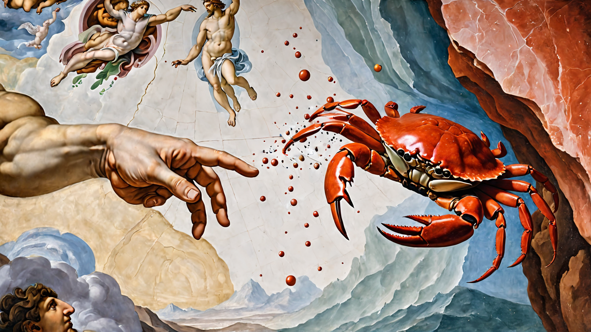

# shadplay



<center>artwork by Maz with SD</center>

## Our [bevy-shader-cheatsheet](bevy-shaders-cheatsheet.md#Contents)

Shadplay is an app designed to help you learn `wgsl` with minimal friction, specifically for those wanting to learn `wgsl` to write shaders for Bevy.
The idea is to give one the minimal amount of bevy boilerplate etc possible to get started writing glsl asap, and provide a library of examples showing how some things are done, can be done etc.

A secondary goal is to flesh out a relatively comprehensive 'port' of existing cool shader work from places like shadertoy etc -- because there's a few 'gotchas' around the differences in `glsl` and `wgsl` syntax, their respective builtins.

A tertiary goal is to surface the builtins/existing library code that Bevy's codebase provides.

______________________________________________________________________

### Why?

> I have found, and continue to find the shader-universe impenetrable, however: I'd rather attempt to write up and document the content I _wish_ I'd been able to find in my first google search, than complain.

______________________________________________________________________

## Features

- A large collection of example shaders illustrating creative and educational uses. `assets/shaders/yourshadergoeshere.wgsl` specifically focusing on `wgsl`.
- Live preview of shader code on Bevy mesh geometry.
- Scripts to format your `wgsl` work, so it looks more rusty.
- Scripts to pull _all_ the functions from the bevy codebase's shader code so you can easily lookup what's available for import.
- Scripts to search the bevy sourcecode (opening your browser) for specific keywords.
- Automatic recompilation and update of shaders upon saving changes in your editor.
- Quick iteration and experimentation with `wgsl` shader code.
- Transparent background, with always-on-top (so you can have it on top of your editor)
- Screenshot the shader you're working on with <kbd>SPACEBAR</kbd>, this will also version the shader (at `assets/shaders/myshader.wgsl`) for you i.e:

```shell
 screenshots
└──|  01-10-23
    └──| 09-23-29
        ├──|  screenshot.png // Your screenshot
        └──|  screenshot.wgsl// The shader at `assets/shaders/myshader.wgsl`
```

- Textures, see `assets/shaders/howto-texture.wgsl`
- Mouse coords over a `uniform`, see `assets/shaders/howto-mouse.wgsl`
- Colour picker with system copy so that you get an immediate `vecf3(r, g, b)` immediately available for quick pasta action.

### Keybindings:

The app has some simple hotkeys:

| Hotkey               | Action                                                                            |
| -------------------- | --------------------------------------------------------------------------------- |
| <kbd>q</kbd>         | Quit                                                                              |
| <kbd>s</kbd>         | Change Shape in 3D                                                                |
| <kbd>tab</kbd>       | Toggles the colour picker (should be supported on most systems...)                |
| <kbd>t</kbd>         | Switch to 2D/ShaderToy Mode                                                       |
| <kbd>h</kbd>         | Switch to 3D                                                                      |
| <kbd>l</kbd>         | Window-Level                                                                      |
| <kbd>d</kbd>         | Toggle Decorations (not all OSes)                                                 |
| <kbd>t</kbd>         | Toggle Transparency (returning to fully transparent is not supported)             |
| <kbd>r</kbd>         | Toggle Rotating shape (3d only)                                                   |
| <kbd>spacebar </kbd> | Takes a screenshot && versions the current `.wgsl`                                |
| <kbd>0</kbd>         | Select the `texture` at index 0                                                   |
| <kbd>1</kbd>         | Select the `texture` at index 1 (assuming you drag-n-dropped a tex onto shadplay) |
| <kbd>2</kbd>         | Select the `texture` at index 2                                                   |
| <kbd>3</kbd>         | Select the `texture` at index 3                                                   |
| <kbd>4</kbd>         | Select the `texture` at index 4                                                   |
| <kbd>5</kbd>         | Select the `texture` at index 5                                                   |
| <kbd>6</kbd>         | Select the `texture` at index 6                                                   |
| <kbd>7</kbd>         | Select the `texture` at index 7                                                   |
| <kbd>8</kbd>         | Select the `texture` at index 8                                                   |
| <kbd>9</kbd>         | Select the `texture` at index 9                                                   |

______________________________________________________________________

To run shadplay, you'll need the following:

- Rust (stable) - Make sure you have Rust installed on your system. You can find installation instructions at [https://www.rust-lang.org/tools/install](https://www.rust-lang.org/tools/install).
  _We assume you can follow their instructions to clear that hurdle_

### Installation

```shell
 $ git clone https://github.com/alphastrata/shadplay.git
 $ cd shadplay
 $ cargo run --release
```

- Then edit the `myshader.wgsl`, or `myshader_2d.wgsl`(if in 2d/shadertoy-mode) file in real time.

______________________________________________________________________

## Contributing:

See the [guide](./CONTRIBUTING.md)

______________________________________________________________________

## TODO:

- \[\] drag n drop obj/stl/gltf opening?
- \[\] material swap to ours system (drag n drop a shader onto the window)
- \[\] hotkey menu display (egui? eframe?)
- \[\] More shader examples (the entirety of shadertoy ported!)
- \[\] demo images (of all shaders in the library)
- \[\] left/right arrows to swap between shaders from the assets' dir
- \[\] buttons to spin/swap the geometry your shader is currently being applied to.
- \[\] hotkey menu display
- \[\] drag n drop shadering ( swap existing MyShader with one that someone drops on.)

______________________________________________________________________

## Resources:

- [Fantastic implementations of some sdf composed shapes](https://gist.github.com/munrocket/f247155fc22ecb8edf974d905c677de1)
- [GM Shaders](https://mini.gmshaders.com)
- [glsl sandbox](https://glslsandbox.com/)
- [Shadertoy](https://www.shadertoy.com/)
- [pcf swap by DGriffin91](https://github.com/DGriffin91/bevy_mod_standard_material/tree/pcf)

______________________________________________________________________

# Gallery:

- Any shaders in the `assets/shaders` _not_ by the repo's owner contain links to the original work, and obviously their original glsl code is, still theirs.
- Some of those can be seen below

<table>
  <tr>
    <td></td>
    <td></td>
  </tr>
  <tr>
    <td></td>
    <td></td>
  </tr>
  <tr>
    <td></td>
    <td></td>
  </tr>
  <tr>
    <td></td>
    <td></td>
  </tr>
  <tr>
    <td></td>
    <td></td>
  </tr>
</table>
