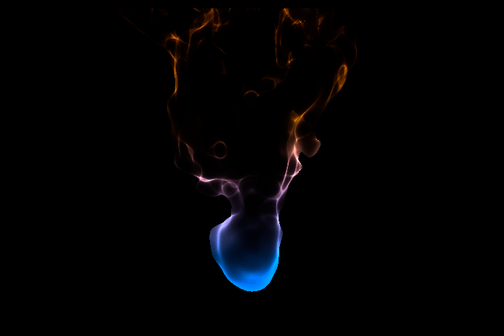

## flame
                 



### fragment

```rust
/// ***************************** ///
/// This is a port of 'Flame' by XT95 https://www.shadertoy.com/view/MdX3zr
/// ***************************** ///

#import bevy_pbr::mesh_vertex_output MeshVertexOutput
#import bevy_sprite::mesh2d_view_bindings globals 
#import shadplay::shader_utils::common rotate2D, PI

#import bevy_render::view  View
@group(0) @binding(0) var<uniform> view: View;

    
@fragment
fn fragment(in: MeshVertexOutput) -> @location(0) vec4<f32> {
    var uv = (in.uv * 2.0) - 1.0;
    let resolution = view.viewport.zw;
    uv *= rotate2D(PI);
    let org: vec3<f32> = vec3<f32>(0.0, -2.0, 4.0);
    let dir: vec3<f32> = normalize(vec3<f32>(uv.x * 1.6, -uv.y, -1.5));
    let p: vec4<f32> = raymarch(org, dir);
    let glow: f32 = p.w;
    let col: vec4<f32> = mix(vec4<f32>(1.0, 0.25, 0.01, 1.0), vec4<f32>(0.07, 0.2, 0.8, 1.0), p.y * 0.02 + 0.4);
    return mix(vec4<f32>(0.0, 0.0, 0.0, 0.0), col, pow(glow * 2.0, 4.0));
}

// Computes a noise value based on a 3D position
fn noise(_p: vec3<f32>) -> f32 {
    var p = _p;
    let i: vec3<f32> = floor(p);
    let a: vec4<f32> = dot(i, vec3<f32>(1.0, 57.0, 21.0)) + vec4<f32>(0.0, 57.0, 21.0, 78.0);
    let f: vec3<f32> = cos((p - i) * acos(-1.0)) * (-0.5) + 0.5;
    let a_val: vec4<f32> = mix(sin(cos(a) * a), sin(cos(1.0 + a) * (1.0 + a)), f.x);
    let a_xy: vec2<f32> = mix(vec2<f32>(a_val.x, a_val.z), vec2<f32>(a_val.y, a_val.w), f.y);
    return mix(a_xy.x, a_xy.y, f.z);
}

// Computes the distance from a point to a sphere
fn sphere(_p: vec3<f32>, spr: vec4<f32>) -> f32 {
    var p = _p;
    return length(spr.xyz - p) - spr.w;
}

// Computes a flame value based on a 3D position
fn flame(_p: vec3<f32>) -> f32 {
    var p = _p;
    let d: f32 = sphere(p * vec3<f32>(1.0, 0.25, 1.0), vec4<f32>(0.0, -1.0, 0.0, 1.0));
    return d + (noise(p + vec3<f32>(0.0, globals.time * 2.0, 0.0)) + noise(p * 3.0) * 0.5) * 0.25 * p.y;
}

// Computes the distance from a ray to the scene
fn scene(_p: vec3<f32>) -> f32 {
    var p = _p;
    return min(100.0 - length(p), abs(flame(p)));
}

// Raymarches the scene and returns the hit point and glow value
fn raymarch(org: vec3<f32>, dir: vec3<f32>) -> vec4<f32> {
    var d: f32 = 0.0;
    var glow: f32 = 0.0;
    let eps: f32 = 0.01;
    var p: vec3<f32> = org;
    var glowed: bool = false;

    for(var i: i32 = 0; i < 96; i = i + 1) {
        d = scene(p) + eps;
        p += d * dir;
        if d > eps {
            if flame(p) < 0.0 {
                glowed = true;
            }
            if glowed {
                glow = f32(i) / 96.0;
            }
        }
    }
    return vec4<f32>(p, glow);
}


```

your comments go here...

