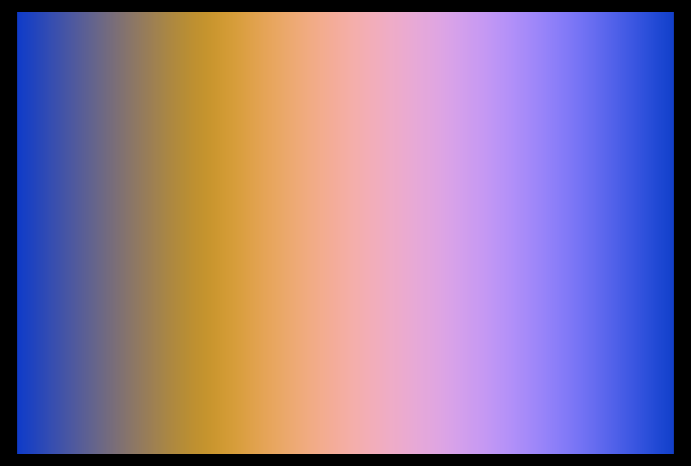

## kishimisu-palette



### fragment

```rust
#import bevy_pbr::mesh_view_bindings globals
#import bevy_pbr::forward_io::VertexOutput


@fragment
fn fragment(in: VertexOutput) -> @location(0) vec4<f32> {
    return kishimisu(in);
}

// This is a port/cover of Kimishisu's awesome YT tutotial: https://www.youtube.com/watch?v=f4s1h2YETNY
fn kishimisu(in: VertexOutput) -> vec4<f32> {
    let uv0 = ((in.uv.xy) * 2.0) - 1.0;
    var uv = (in.uv.xy) ;

    var output = vec3(0.0);

    for (var i = 0.0; i < 1.0; i += 1.0) {
        uv = fract((uv * .0982)) - 1.225;

        var d = length(uv) * exp(-length(uv0));

        var col = palette(length(uv0) + (i * 4.3) + (globals.time * .4));

        d = sin(d * 8. + globals.time) / 4.;
        d = abs(d);

        d = pow(0.01 / d, 1.8);

        output += col * d;
    }

    return vec4<f32>(output, 1.0);
}

fn palette(t: f32) -> vec3<f32> {
    let a = vec3<f32>(0.5, 0.5, 0.5);
    let b = vec3<f32>(0.5, 0.5, 0.5);
    let c = vec3<f32>(1.0, 1.0, 1.0);
    let d = vec3<f32>(0.263, 0.416, 0.557);

    return a + b * cos(6.28318 * (c * t + d));
}
```

your comments go here...
