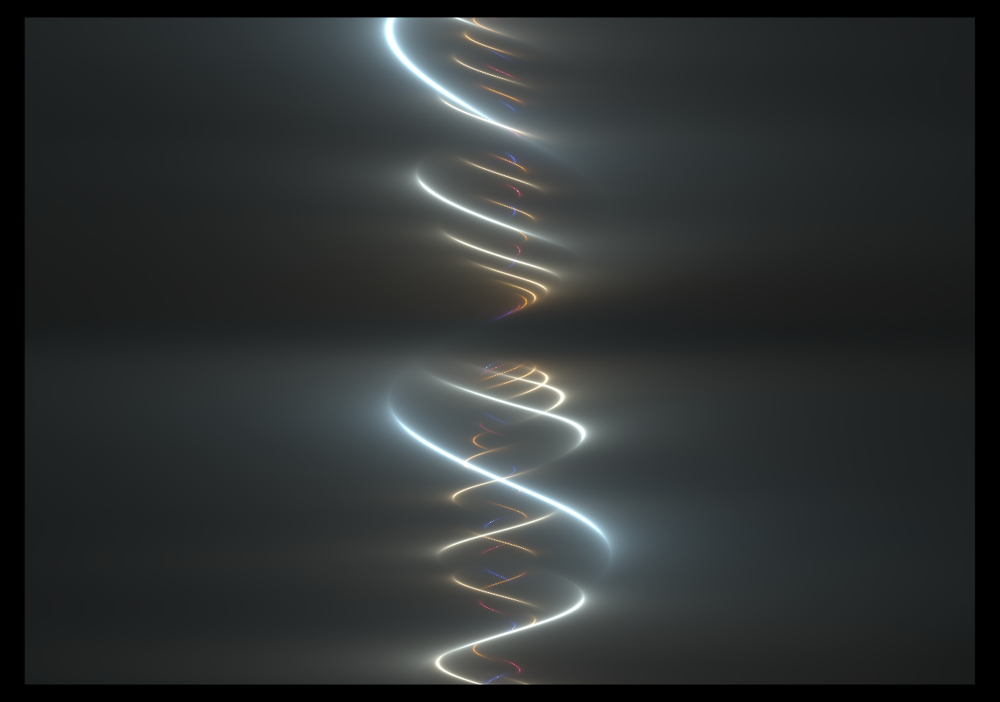

## sailing-beyond



### fragment

// This is a port of `light spirals` by `felipetovarhenao` on shadertoy. https://www.shadertoy.com/view/DlccR7

```rust
#import bevy_sprite::mesh2d_view_bindings::globals 
#import bevy_render::view::View
#import bevy_pbr::forward_io::VertexOutput;

@group(0) @binding(0) var<uniform> view: View;

const SPEED:f32 = 0.30;
const PI: f32 = 3.14159265359;
const TWO_PI = 6.2848;
const NUM_ITER = 8.0;

// This is a port of `light spirals` by `felipetovarhenao` on shadertoy. https://www.shadertoy.com/view/DlccR7
@fragment
fn fragment(in: VertexOutput) -> @location(0) vec4<f32> {
    var uv = (in.uv * 2.0) - 1.0;
    let resolution = view.viewport.zw;
    let t = globals.time * SPEED;
    uv.x *= resolution.x / resolution.y;

    //NOTE: we're not rotating, which allows us to remove the original's adjust_viewport
    return spirals(uv, resolution, t);
}    

// draw the 'spirals' 
fn spirals(_uv: vec2f, resolution: vec2f, t: f32) -> vec4f {
    var uv = _uv;
    // Something blank to paint onto!
    var col: vec3f = vec3(0.0, 0.0, 0.0);

    // Setup a colour palette:
    let c1: vec3f = vec3(0.5, 0.5, 0.5);
    let c2: vec3f = vec3(0.5, 0.5, 0.5);
    let c3: vec3f = vec3(0.1, 0.1, 0.1);
    let c4: vec3f = vec3(0.6, 0.7, 0.8);

    let mag: f32 = length(uv);

    // `d` is distance, we'll get multiple 'distances' that we're interested in using them as we override them in the loop.
    var d: f32 = 0.0;
    for (var i: f32 = 0.0; i < NUM_ITER; i += 1.0) {
        let h: f32 = i + 1.0;
        let ph: f32 = t + noise_overload_3(uv);
        let amp: f32 = pow(1.333, i);
        let fq: f32 = uv.y * TWO_PI * h;
        let sig: f32 = sin(fq + ph * h) * (0.333 / amp);
        d = uv.x + sig;
        d = abs(d);
        let gap: f32 = cos(fq * 0.4 + t);
        var a: f32 = abs(gap);
        a = pow(a, 5.0);
        d += a;
        let lum: f32 = scale(sin(ph * h), -1.0, 1.0, 0.003, 0.007) * (NUM_ITER * 0.25 / h);
        d = lum / abs(d);
        col += d * gradient(h + t, c1, c2, c3, c4);
    }

    return vec4<f32>(col, 1.0);
}

// Helpers:
fn rand(x: f32, s: i32) -> f32 {
    return fract(sin(x + f32(s)) * 43758.5453123);
}


//NOTE: wgsl doesn't support function overloading -- I know not whether or not there's a convention developing yet, so for now I've just enumerated them.
fn rand_overload_1(x: f32) -> f32 {
    return rand(x, 0);
}

fn rand_overload_2(uv: vec2f, seed: i32) -> f32 {
    return fract(sin(dot(uv.xy, vec2f(12.9898, 78.233)) + f32(seed)) * 43758.5453123);
}

fn rand_overload_3(uv: vec2f) -> f32 {
    return rand_overload_2(uv, 0);
}

fn noise(x: f32, s: i32) -> f32 {
    let xi = floor(x);
    let xf = fract(x);
    return mix(rand(xi, s), rand(xi + 1.0, s), smoothstep(0.0, 1.0, xf));
}

fn noise_overload_1(x: f32) -> f32 {
    return noise(x, 0);
}

fn noise_overload_2(p: vec2f, s: i32) -> f32 {
    let pi = floor(p);
    let pf = fract(p);

    let bl = rand_overload_2(pi, s);
    let br = rand_overload_2(pi + vec2f(1.0, 0.0), s);
    let tl = rand_overload_2(pi + vec2f(0.0, 1.0), s);
    let tr = rand_overload_2(pi + vec2f(1.0), s);

    let w = smoothstep(vec2f(0.0), vec2f(1.0), pf);

    let t = mix(tl, tr, w.x);
    let b = mix(bl, br, w.x);

    return mix(b, t, w.y);
}

fn noise_overload_3(p: vec2f) -> f32 {
    return noise_overload_2(p, 0);
}

fn scale(x: f32, a: f32, b: f32, c: f32, d: f32) -> f32 {
    return (x - a) / (b - a) * (d - c) + c;
}

fn gradient(t: f32, a: vec3f, b: vec3f, c: vec3f, d: vec3f) -> vec3f {
    return a + b * cos(TWO_PI * (c * t + d));
}
	
```

# Notes:

- The scale and gradient I think are really nice and useful little numbers to have!

### fn scale(x: f32, a: f32, b: f32, c: f32, d: f32) -> f32:

Takes x from a range of a..b and returns it as a range from c..d
This little python script may be more understandable:
\`\`\`py
\# The same logic as our scale function above in the wgsl example
def scale(x, a, b, c, d):
return (x-a)/(b-a)\*(d-c)+c

````
# Generate 10 values between 0 and 1
values = [i/10 for i in range(11)]

# Scale values of `x` from 0..1 to 0..100
scaled_values = [scale(x, 0, 1, 0, 100) for x in values]

# Print the scaled values
for i, val in enumerate(scaled_values):
    print(f'Original: {values[i]}, Scaled: {val}')
```
which gives you:
```
Original: 0.0, Scaled: 0.0
Original: 0.1, Scaled: 10.0
Original: 0.2, Scaled: 20.0
Original: 0.3, Scaled: 30.0
Original: 0.4, Scaled: 40.0
Original: 0.5, Scaled: 50.0
Original: 0.6, Scaled: 60.0
Original: 0.7, Scaled: 70.0
Original: 0.8, Scaled: 80.0
Original: 0.9, Scaled: 90.0
Original: 1.0, Scaled: 100.0
```
````

it seems to work bidirectionally which is cool.
