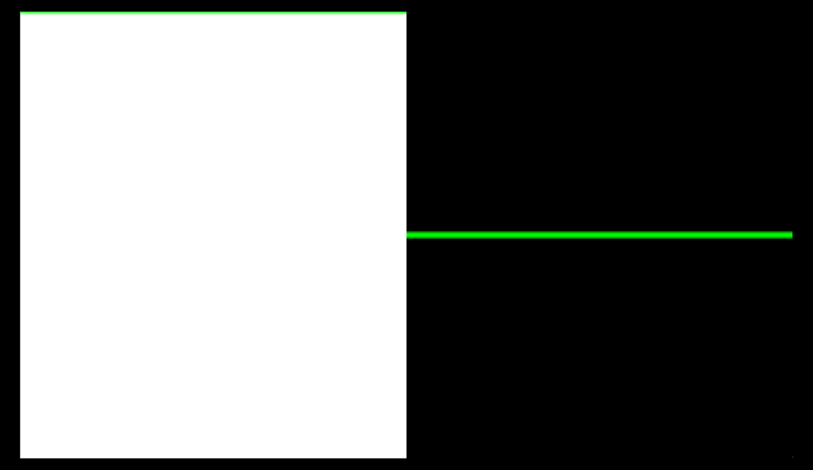

#### fragment



```rust
@fragment
fn fragment(in: MeshVertexOutput) -> @location(0) vec4<f32> {
    let resolution: vec2f = view.viewport.xy;
    var uv = in.uv.xy * -2.0 + 1.0; // either do uv.yx and then rotate or just flip em here..
    var col = vec3f(0.0);
    let x = uv.x;

    var y = ceil(x);
    col = vec3f(y);


    let pct: f32 = plot(uv, y);
    let a: vec3f = (1.0 - pct) * col;
    col = a + pct * vec3(0.0, 1.0, 0.0);


    return vec4f(col, 1.0);
}

fn plot(st: vec2f, pct: f32) -> f32 {
    let l = pct - 0.02;
    let r = pct + 0.02;

    return smoothstep(l, pct, st.y) - smoothstep(pct, r, st.y);
}

```

### Summary

#### y = ceil(x);

Return the nearest integer that is greater than or equal to x
