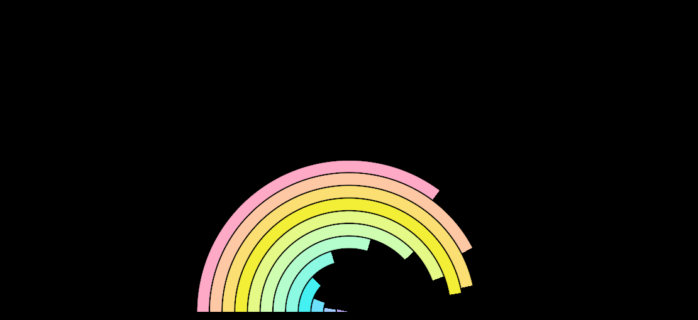

## semi-circle-waves



### fragment

```rust
//
// This is a port of the Semi-circle Wave Animation by Shane https://www.shadertoy.com/view/cdycRt
//
#import bevy_pbr::mesh_vertex_output MeshVertexOutput
#import bevy_sprite::mesh2d_view_bindings globals 
#import shadplay::shader_utils::common NEG_HALF_PI, rotate2D, HALF_PI, PI, TAU

#import bevy_render::view  View
@group(0) @binding(0) var<uniform> view: View;

const SPEED:f32 = 2.0;
const NUM_ITERATIONS: f32 = 14.0;
const LINE_GIRTH:f32 = 0.4;

@fragment
fn fragment(in: MeshVertexOutput) -> @location(0) vec4<f32> {
    var uv = (in.uv * 2.0) - 1.0;
    let resolution = view.viewport.zw;
    let time = globals.time * SPEED;
    uv.x *= resolution.x / resolution.y;

    let col = radial_arc_pattern(uv, resolution, time);
    return col;
}    

// @param resolution - The screen resolution
// @param time - The current time for animation
// @return The computed color for the fragment  
fn radial_arc_pattern(_uv: vec2f, resolution: vec2f, time: f32) -> vec4<f32> {
    var uv = _uv;
    uv.y -= 1.0; // Move the Y axis down so the circle comes outta the floor, not halfway on the screen.
    uv.y *= -1.0;

    // Convert to polar coordinates
    var p: vec2f = vec2f(atan2(uv.y, uv.x) / TAU, length(uv));

    // Constants for radial repetition
    let l_num: f32 = 12.0; // The number of lines
    p.y = clamp(p.y, 0.0, 1.0);
    let iy: f32 = floor(p.y * l_num);
    p.y -= (iy + 0.5) / l_num;

    // Calculate the restricted arc rendering angle
    let ang: f32 = (sin(time + iy * PI / l_num * HALF_PI) * 0.9 + 1.0) / 4.0;

    var d: f32;
    if p.x < ang {
        d = 1e5;
    } else {
        d = abs(p.y) - LINE_GIRTH / l_num;
    }

    // Add rounded line ends
    var ang2: f32 = (PI + ang) * TAU;
    if uv.x < 0.0 && uv.y < 0.0 {
        ang2 = NEG_HALF_PI;
    }
    let c: f32 = cos(ang2);
    let s: f32 = sin(ang2);
    p = vec2f(c * uv.x + s * uv.y, -s * uv.x + c * uv.y);
    p.y = clamp(p.y, 0.0, 1.0);
    let iy2: f32 = floor(p.y * l_num);
    p.y -= (iy2 + 0.5) / l_num;
    d = min(d, length(p) - 0.2 / l_num);

    // Assign colors to individual arcs
    let s_col: vec3<f32> = 0.5 + 0.5 * cos(TAU * iy / l_num * 0.8 + vec3<f32>(0.0, 2.0, 4.0) + 2.0);
    let col: vec3<f32> = mix(vec3<f32>(0.0), s_col, 1.0 - smoothstep(0.0, 3.0 / resolution.y, d));

    // Apply rough gamma correction and return the final color
    return vec4<f32>(sqrt(col), 1.0); // Remove the sqrt() to see a more 'saturated' image.
}

```

your comments go here...
