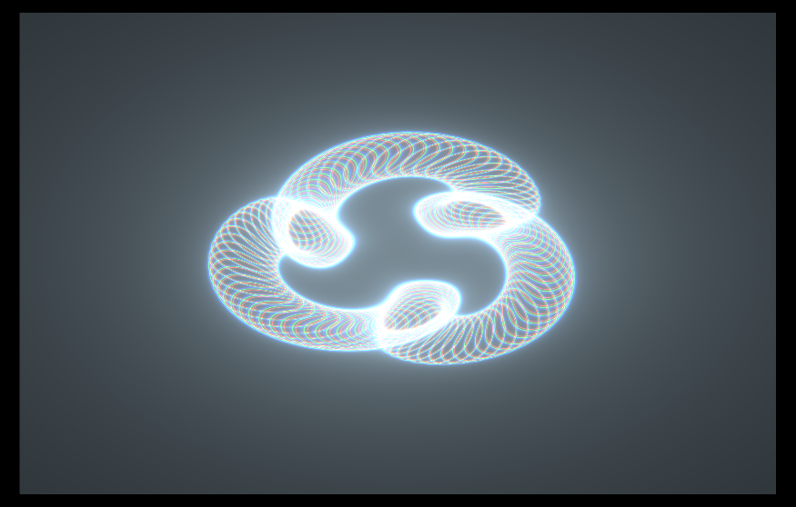

## slug-ring



## Fragment:

````
```rust
#import bevy_sprite::mesh2d_view_bindings::globals
````

#import shadplay::shader_utils::common::{NEG_HALF_PI, PI, shader_toy_default, rotate2D, TWO_PI}
#import bevy_render::view::View
#import bevy_pbr::forward_io::VertexOutput;

@group(0) @binding(0) var<uniform> view: View;

const SPEED:f32 = 0.4;
const N:i32 = 120;

/// This is a sharderoy port of 'slug-ring' by amagitakayosi: https://www.shadertoy.com/view/clVyR1c
@fragment
fn fragment(in: VertexOutput) -> @location(0) vec4<f32> {

```
// Setup
var uv = (in.uv * 2.0) - 1.0;
let resolution = view.viewport.zw;
let t = globals.time * SPEED;
uv.x *= resolution.x / resolution.y;
uv *= rotate2D(NEG_HALF_PI);
```

/// Their actual shader...
return slug_ring(uv, resolution, t);
}

/// Their actual shader...
fn slug_ring(uv: vec2f, resolution: vec2f, time: f32)->vec4f{

```
let R: vec2<f32> = resolution.xy;
let y_inverted_location = vec2<i32>(i32(uv.x), i32(R.y) - i32(uv.y));
let location = vec2<i32>(i32(uv.x), i32(uv.y));

var fragCoord = vec2<f32>(f32(location.x), f32(location.y) );

var p: vec2<f32> = uv;
p.x = p.x * (resolution.x / resolution.y);
p = p * (2.);
let a: f32 = atan2(p.y, p.x);
var col: vec3<f32>;

for (var i: i32 = 0; i < N; i = i + 1) {
	let fi: f32 = f32(i);
	let t: f32 = fi / f32(N);
	let aa: f32 = (t + time / 12.) * 2. * PI;
	let size: f32 = 0.3 + sin(t * 6. * PI) * 0.1;
	var a1: f32 = -time * PI / 3. + aa;
	a1 = a1 + (sin(length(p) * 3. + time * PI / 2.) * 0.3);
	let c1: vec2<f32> = vec2<f32>(cos(a1), sin(a1));
	let a2: f32 = aa * 4.;
	let c2: vec2<f32> = vec2<f32>(cos(a2), sin(a2)) * 0.3 + c1;
	col.r = col.r + (0.001 / abs(length(p - c2) - size));
	col.g = col.g + (0.0013 / abs(length(p - c2) - size * 1.05));
	col.b = col.b + (0.0015 / abs(length(p - c2) - size * 1.09));
}

return vec4<f32>(col, 1.);
```

}
