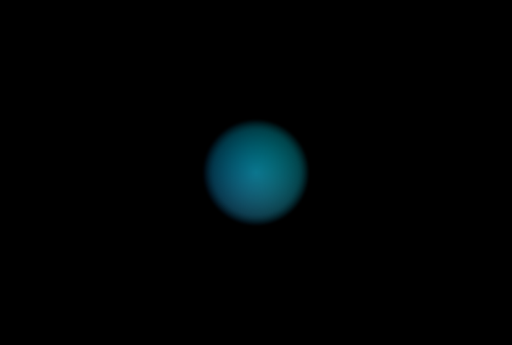

## smoothstep-colouring-a-2dCircle



### fragment

```rust
#import bevy_pbr::forward_io::VertexOutput
#import bevy_sprite::mesh2d_view_bindings globals 
#import bevy_pbr::utils PI

#import bevy_render::view  View
@group(0) @binding(0) var<uniform> view: View;

const SPEED:f32 = 1.80;
const SIZE: f32 = 1.2;

@fragment
fn fragment(in: VertexOutput) -> @location(0) vec4<f32> {
    // ensure our uv coords match shadertoy/the-lil-book-of-shaders
    var uv = (in.uv * 2.0) - 1.0;
    let resolution = view.viewport.zw;
    let t = globals.time * SPEED;
    uv.x *= resolution.x / resolution.y;
    uv *= rotate2D(PI / -2.0);

    // Create some colour, do nothing with it.
    var col = vec4f(0.0);
    var base_colour = shader_toy_default(t, uv);

    // sdf for a 2D circle
    uv /= SIZE; // Make uvs bigger 
    let d = -1.0 * sd_circle(uv, 0.3); // -1 to flip it so we're drawing the circle in colour, not the space around it.
    
    base_colour *= smoothstep(0.02, 0.09, d); // use the smoothstep to colour BY the circle's sdf.
    col = vec4f(base_colour, d); // use the circle's sdf to, in the same way it supplies values to the smoothstep above, also be the alpha values -- so our 'background' is transparent.

    return col;
}

fn sd_circle(pt: vec2f, radius: f32)->f32{
    return length(pt) - radius;
}

/// This is the default (and rather pretty) shader you start with in ShaderToy
fn shader_toy_default(t: f32, uv: vec2f)-> vec3f{
    var col = vec3f(0.0);
    let v = vec3(t) + vec3(uv.xyx) + vec3(0., 2., 4.);
    return 0.5 + 0.5 * cos(v);
}

fn dist_line(ray_origin: vec3f, ray_dir: vec3f, pt: vec3f) -> f32 {
    return length(cross(pt - ray_origin, ray_dir)) / length(ray_dir);
}

/// Clockwise by `theta`
fn rotate2D(theta: f32) -> mat2x2<f32> {
    let c = cos(theta);
    let s = sin(theta);
    return mat2x2<f32>(c, s, -s, c);
}

```

your comments go here...
