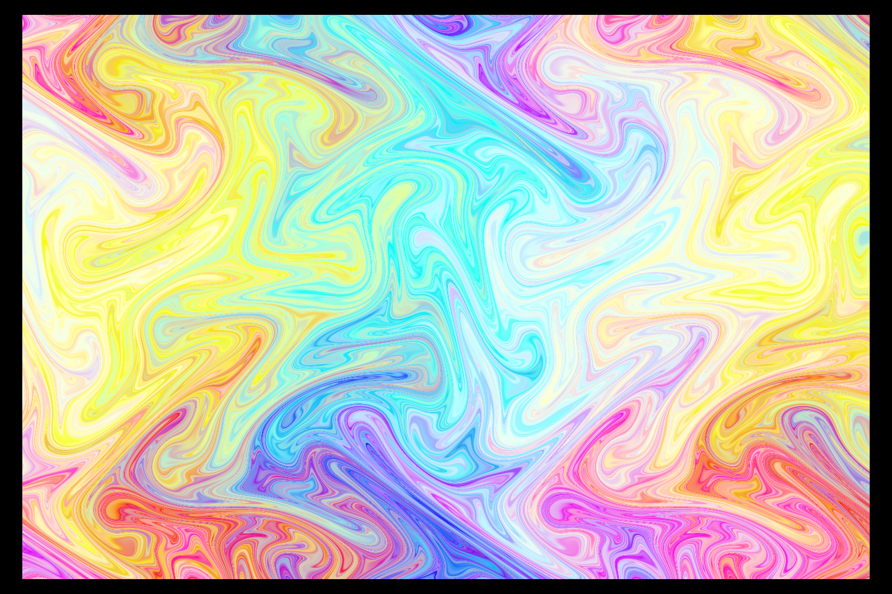

## warp



### fragment

```rust
///
/// This is a port of "WARP" by Alro https://www.shadertoy.com/view/ttlGDf
///
#import bevy_pbr::mesh_vertex_output MeshVertexOutput;
#import bevy_sprite::mesh2d_view_bindings globals;
#import bevy_render::view View;

@group(0) @binding(0) var<uniform> view: View;

const STRENGTH: f32 = 0.4;  // Controls the strength of the waves
const SPEED: f32 = 0.33333; // Controls the speed at which the waves run

@fragment
fn fragment(in: MeshVertexOutput) -> @location(0) vec4<f32> {
    var uv: vec2<f32> = (in.uv * 2.0) - 1.0;
    let resolution: vec2<f32> = view.viewport.zw;
    let time: f32 = globals.time * SPEED;

    return warp_with_aa(uv, resolution, time);
}

// Without the Anti-Aliasing.
fn warp_without_aa(uv: vec2f, resolution: vec2f, time: f32) -> vec4f {
    // Normalized pixel coordinates (from -1 to 1)
    var pos: vec2<f32> = uv;
    pos.y /= resolution.x / resolution.y;
    pos = 4.0 * (vec2<f32>(0.5, 0.5) - pos);

    for (var k: f32 = 1.0; k < 7.0; k += 1.0) {
        pos.x += STRENGTH * sin(2.0 * time + k * 1.5 * pos.y) + time * 0.5;
        pos.y += STRENGTH * cos(2.0 * time + k * 1.5 * pos.x);
    }

    // Time varying pixel color
    let col: vec3<f32> = 0.5 + 0.5 * cos(time + pos.xyx + vec3<f32>(0.0, 2.0, 4.0));

    // Gamma correction
    let gamma_corrected_col: vec3<f32> = pow(col, vec3<f32>(0.4545, 0.4545, 0.4545));

    // Fragment color
    return vec4<f32>(gamma_corrected_col, 1.0);
}

fn warp_with_aa(uv: vec2f, resolution: vec2f, time: f32) -> vec4f {
    var color: vec3<f32> = vec3<f32>(0.0, 0.0, 0.0);
    var frag_coord: vec2<f32> = uv * resolution;

    // Anti-aliasing loop
    for (var i: i32 = -1; i <= 1; i = i + 1) {
        for (var j: i32 = -1; j <= 1; j = j + 1) {
            frag_coord = uv * resolution + vec2<f32>(f32(i), f32(j)) / 3.0;

            var pos: vec2<f32> = frag_coord / resolution;
            pos.y /= resolution.x / resolution.y;
            pos = 4.0 * (vec2<f32>(0.5, 0.5) - pos);

            for (var k: f32 = 1.0; k < 7.0; k = k + 1.0) {
                pos.x += STRENGTH * sin(2.0 * time + k * 1.5 * pos.y) + time * 0.5;
                pos.y += STRENGTH * cos(2.0 * time + k * 1.5 * pos.x);
            }

            color += 0.5 + 0.5 * cos(time + pos.xyx + vec3<f32>(0.0, 2.0, 4.0));
        }
    }

    color /= 9.0;
    
    // Gamma correction
    color = pow(color, vec3<f32>(0.4545, 0.4545, 0.4545));

    return vec4<f32>(color, 1.0);
}
```

your comments go here...
