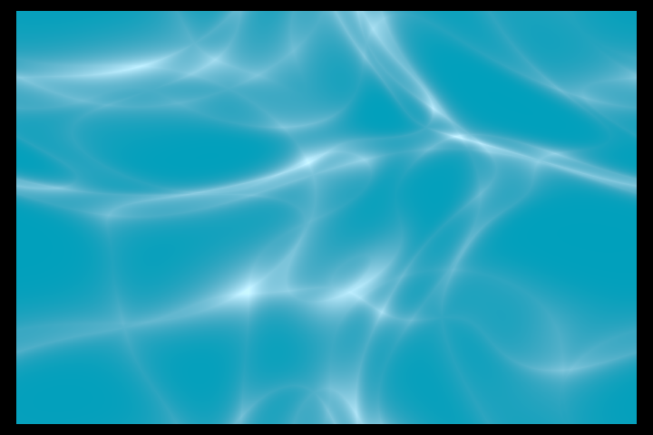

## water-caustics
                 



### fragment

```rust
/// ***************************** ///
/// This is a shadertoy port of 'Tileable Water Caustic' by Dave_Hoskins, who claims to of sound it on glsl sandbox, by 'joltz0r' 
/// I have been unable to find the original.
/// ***************************** ///

#import bevy_pbr::mesh_vertex_output MeshVertexOutput
#import bevy_sprite::mesh2d_view_bindings globals 
#import shadplay::shader_utils::common NEG_HALF_PI, shader_toy_default, rotate2D, TAU

#import bevy_render::view  View
@group(0) @binding(0) var<uniform> view: View;

const MAX_ITER: i32 = 3;
const SPEED:f32 = 1.0;
    
@fragment
fn fragment(in: MeshVertexOutput) -> @location(0) vec4<f32> {
    let time: f32 = globals.time * 0.5 + 23.0;
    var uv: vec2<f32> = in.uv;

    // Tiling calculation
    var p: vec2<f32>;
    // Note: Choose one of the following two lines based on whether SHOW_TILING is defined or not
    // p = uv * TAU * 2.0 % TAU - 250.0;  // show TILING
    p = uv * TAU % TAU - 250.0;           // hide TILING

    var i: vec2<f32> = vec2<f32>(p); // iterator position
    var c: f32 = 1.0; // colour intensity
    let inten: f32 = 0.005; // Intensity factor

    for (var n: i32 = 0; n < MAX_ITER; n = n + 1) {
        let t: f32 = time * (1.0 - (3.5 / f32(n + 1)));
        i = p + vec2<f32>(cos(t - i.x) + sin(t + i.y), sin(t - i.y) + cos(t + i.x));
        c += 1.0 / length(vec2<f32>(p.x / (sin(i.x + t) / inten), p.y / (cos(i.y + t) / inten)));
    }

    // c = colour intensity
    c /= f32(MAX_ITER);
    c = 1.17 - pow(c, 1.4);
    var colour: vec3<f32> = vec3<f32>(pow(abs(c), 8.0));
    colour = clamp(colour + vec3<f32>(0.0, 0.35, 0.5), vec3<f32>(0.0, 0.0, 0.0), vec3<f32>(1.0, 1.0, 1.0));
    

    // Show grid:
    // let pixel: vec2<f32> = vec2<f32>(2.0) / view.viewport.zw;
    // uv *= 2.0;
    // let flash: f32 = floor(globals.time * 0.5 % 2.0);
    // let first: vec2<f32> = step(pixel, uv) * flash;
    // uv = step(fract(uv), pixel);
    // colour = mix(colour, vec3<f32>(1.0, 1.0, 0.0), (uv.x + uv.y) * first.x * first.y);

    return vec4<f32>(colour, 1.0);
}

```

your comments go here...

